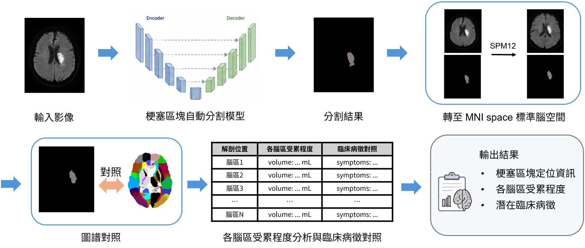
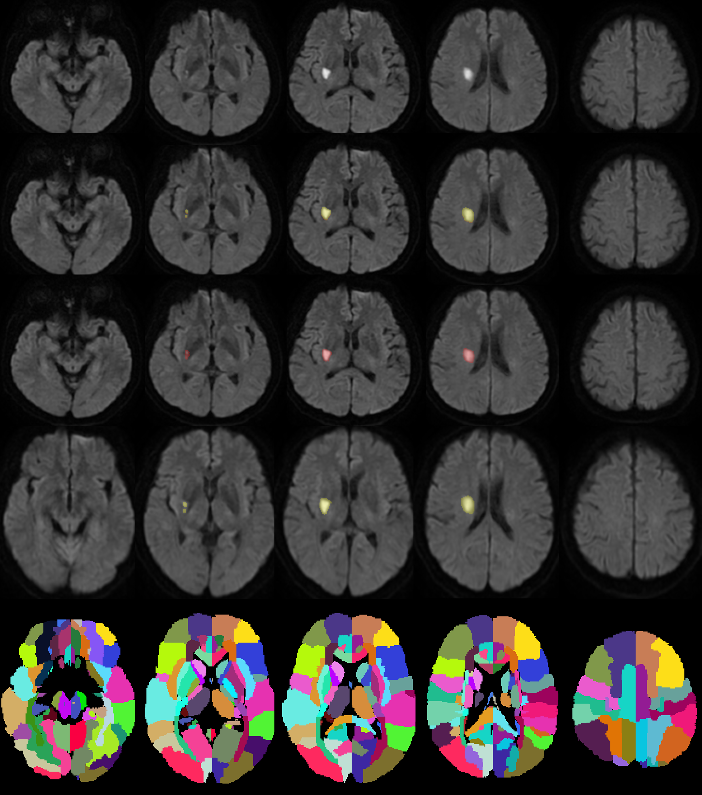

---

StrokeAI 是一套以 Python 開發的 DWI 缺血性腦中風梗塞分析工具，支援載入 NIfTI 與 DICOM 影像，並透過 nnU-Net 自動進行中風梗塞病灶解剖定位與體積定量分析。
系統提供直覺化 GUI，可切換 Axial、Sagittal、Coronal 與 3V 三視角顯示模式，協助使用者檢視不同方向的腦部切面。使用者也可開啟 Overlay 疊圖，並調整透明度，以比對原始影像與分割結果。  
介紹影片 : https://youtu.be/Ni56nUVgeC8

---

主要功能包含：
- 支援 NIfTI（.nii）及 DICOM 影像輸入
- 整合 nnU-Net 腦梗塞分割模型
- 顯示原始影像、ROI 與 Atlas 分割結果
- 支援 Ax、Sag、Cor、3V 多視角檢視
- 可依 Slice 控制切面位置
- 支援分割結果 Overlay 與透明度調整
- 進行梗塞病灶定位定量分析
- 提供定位定量結果對應可能發生的臨床病徵

StrokeAI 的目標是將醫學影像前處理、AI 分割、視覺化與量化分析整合在同一個操作介面中，降低影像分析流程的操作門檻，提升腦中風相關影像研究與判讀的效率。

---

## 分析流程

首先將 DWI 輸入腦梗塞自動分割模型，取得梗塞病灶分割結果。接著利用 SPM12 將原始 DWI 與分割結果轉換至 MNI space 標準腦空間並與  
腦區圖譜進行對照，以判定病灶所涉及的解剖腦區。之後針對各受累腦區進行定量分析，計算病灶於各腦區中的分布比例、腦區受累比例及梗塞體積。
最後將定量結果與臨床病徵對照表進行配對，輸出梗塞病灶定位資訊、梗塞體積及可能相關之臨床病徵。

---

## 開發方法

---

## 分割效能

### 腦梗塞病灶分割結果示意圖

- 第一列為原始 DWI
- 第二列為腦梗塞自動分割模型分割後之中風梗塞病灶體素(黃色區域)覆蓋於原始影像上
- 第三列為 golden standard 之中風梗塞病灶體素(紅色區域)覆蓋於原始 DWI 上
- 第四列為透過 SPM12 將原始 DWI 與分割結果正規化至標準腦空間之結果
- 第五列為腦部解剖圖譜與上方影像對應之 slice

